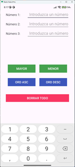
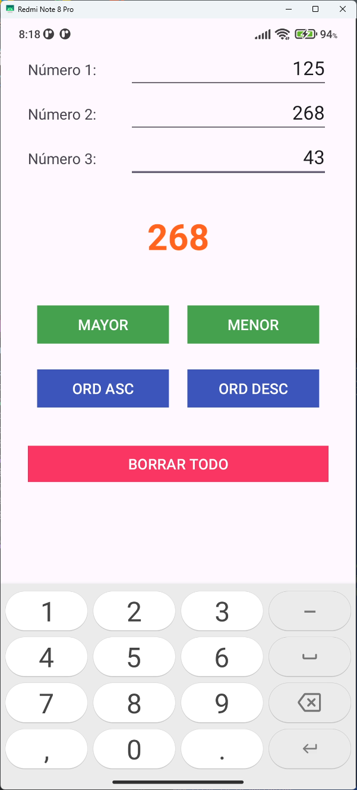
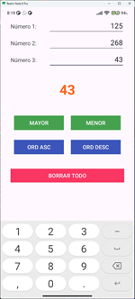
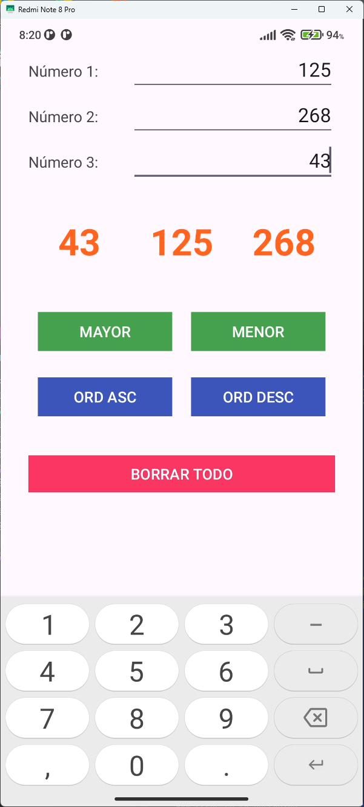
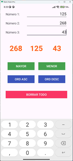
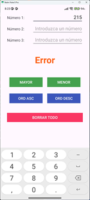

# Tres números

Esta es una app Android sencilla que permite realizar operaciones básicas entre tres números.

## 📱 Interfaz de Usuario (UI)

- **Padding general:** Todos los componentes están a 30dp hacia el interior.
- **Número 1, Número 2 y Número 3:**
    - `TextView` con texto "Número 1:", "Número 2:" y "Número 3:"respectivamente.
    - `EditText` asociado a cada uno:
        - Hint: "Introduzca un número".
        - Alineado a la derecha.
        - Acepta números enteros.
        - Inicialmente vacío.
- **Resultado1, Resultado 2, Resultado 3:**
    - `TextView` con texto por defecto "".
    - Tamaño de fuente mayor, color naranja, contenido centrado.
- **Botones de operación obtener un sólo número:**
    - Botones con texto "MAYOR" y "MENOR" respectivamente.
    - Color de fondo verde, esquinas rectas.
- **Botones de operación ordenación:**
    - Botones con texto "ORD ASC" y "ORD DESC" respectivamente.
    - Color de fondo azul, esquinas rectas.
- **Botón de borrado:**
    - Texto "BORRAR TODO".
    - Fondo rojo, esquinas rectas.

## ⚙️ Funcionalidad

- Cada botón realiza su operación si ambos campos numéricos son válidos. Si no, se muestra "Error" en Resultado2.
- Botones de operación:
    1. **[ MAYOR ]** Obtiene el número mayor de los tres y lo muestra en Resultado2.
    2. **[ MENOR ]** Obtiene el número menor de los tres y lo muestra en Resultado2.
    3. **[ ORD ASC ]** Ordena los tres números de menor a mayor y los muestra en Resultado1, Resultado2 y Resultado3.
    4. **[ ORD DESC ]** Ordena los tres números de mayor a menor y los muestra en Resultado1, Resultado2 y Resultado3.
- El botón **[BORRAR TODO]** borra todos los campos de texto y los resultados.

## 🛠️ Tecnologías usadas

- Android Studio
- Java
- XML (para layouts)
- API mínima: 28+ (Android 9.0)

## 📂 Estructura del proyecto

```
/app/src/main/java/.../MainActivity.java (funcionalidad básica)
/app/src/main/java/.../MainActivityV2.java (refactorización de código, todas las operaciones se basan en ordenar un vector)
/app/src/main/res/layout/activity_main.xml
```

## 📸 Capturas de pantalla

### Pantalla principal



### Obtener el mayor



### Obtener el menor



### Ordenar ascendentemente



### Ordenar descendentemente



### Error en la operación



## 📄 Licencia

Este proyecto es de uso educativo y puede modificarse libremente.